# COMP1110 Assignment 1

## Academic Honesty and Integrity

Honesty and integrity are of utmost importance. These goals are *not* at odds
with being resourceful and working collaboratively. You *should* be resourceful
and you should discuss the assignment
and other aspects of the course with others taking the class. However, *you must
never misrepresent the work of others as your own*. If you have taken ideas from
elsewhere or used code sourced from elsewhere, you must say so with *utmost
clarity*. At each stage of the assignment you will be asked to submit a statement
of originality, either as a group or as individuals. This statement is the place
for you to declare which ideas or code contained in your submission were sourced
from elsewhere.

Please read the ANU's [official position](http://academichonesty.anu.edu.au/) on
academic honesty. If you have any questions, please ask me.

Carefully review the [statement of originality](originality.md) which you must
complete.  Edit that statement and update it as you complete the assignment,
ensuring that when you complete the assignment, a truthful statement is committed
and pushed to your repo.

## Purpose

In this assignment is introductory, helping you gain familiarity with the basics
of Java, but doing so in the context of slightly larger piece of code.  Most
of the assignment is composed of a series of small tasks.

## Assignment Deliverable

The assignment is worth 5% of your total assessment, and it will be marked out
of 5. However, these marks are [redeemable](https://cs.anu.edu.au/courses/comp1110/assessments/redeemable/) by the exam, so if your exam mark / 20
is higher than your assignment one mark, you will get the exam mark / 20 rather
than the assignment one mark. **The mark breakdown is described on the
[deliverables](https://cs.anu.edu.au/courses/comp1110/assessments/deliverables/#D1A) page.**

The assignment is due at **[10:45am Friday Week 3](https://www.timeanddate.com/worldclock/fixedtime.html?msg=Assignment+1+Due&iso=20190809T0045&p1=%253A), 9 August 2019** ([time remaining](https://www.timeanddate.com/countdown/generic?p0=1440&iso=20190809T0045&msg=Assignment%201%20Due)).
You can find [this deadline](https://cs.anu.edu.au/courses/comp1110/assessments/deliverables/#D1A)
on the [deliverables page](https://cs.anu.edu.au/courses/comp1110/assessments/deliverables/), where all assignment deadlines for this semester are
listed.
Your tutor will mark your assignment by accessing your GitLab repository, so it is essential that you carefully follow
instructions for setting up and maintaining your repository. You will be marked
according to **whatever is committed to your repository at the time of the deadline**.
Since the first assignment is redeemable, **[late extensions
are not offered and will not be given](https://cs.anu.edu.au/courses/comp1110/deadlines/)**. As always, throughout the course, if
some significant circumstance arises outside of the course that affects your capacity to complete the course, please carefully follow the ANU's [special consideration process](http://www.anu.edu.au/students/program-administration/assessments-exams/special-assessment-consideration), and your circumstances will be accounted for in your final assessment.

## Overview

The assignment is based on a simple children's puzzle called
[DINOSAURS – MYSTIC ISLANDS
](https://www.smartgames.eu/uk/one-player-games/dinosaurs-%E2%80%93-mystic-islands),
made by [SmartGames](http://www.smartgames.eu), a producer of
educational games.  The design of the game and all of the imagery in
this assignment comes from their DINOSAURS game.

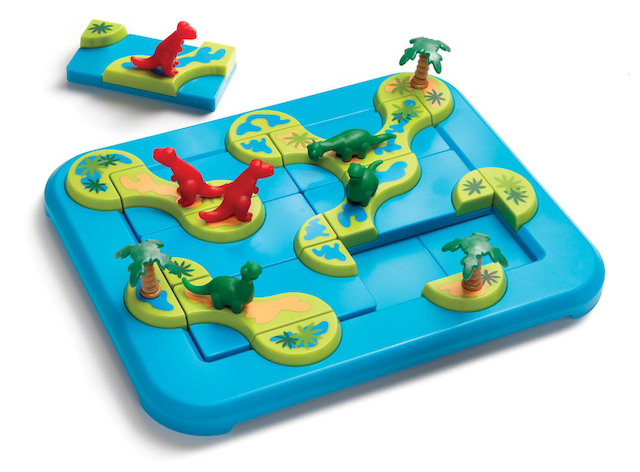

The game is played by rotating and placing six 1x2-sized tiles on a
3x2 grid.  Each tile includes one to three paths, which connect its
nearby tiles to each other or the borders.  Also, there is exactly one
green or red dinosaur on each tile.

## Tiles

The game comprises six 1x2 playing tiles, which we encode using
characters `a` to `f`.  Each tile can be rotated at 90 degree
increments, allowing for 4 different orientations (North, East, South
and West).  The following illustration shows all 24 possible
combinations of the 6 pieces and 4 orientations.

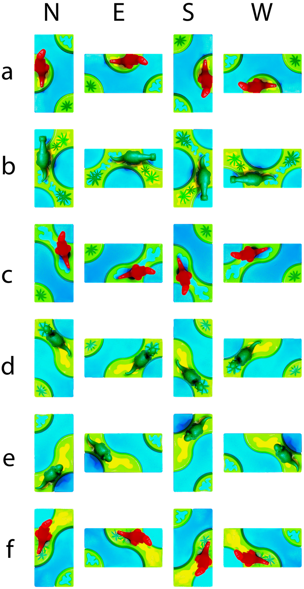

## Objective

The objective of the game is to place the tiles in such a way as to
**create a specified shape of islands**, with the special requirement
that **no dinosaurs of different colors end up on the same island**.   The
specification of the objective may include the placement of some of
the six tiles, which makes the objective easier.

A sample objective shape is shown here:

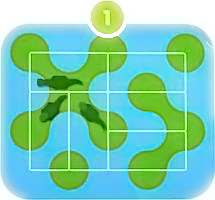

This is objective 1 from the original board game, and is easy to
solve.  The placement of the three green dinosaur tiles has be
specified, so the challenge for the player is just to work out how to
place the red dinosaur tiles correctly.

The game is successfully completed once *all* six tiles are placed
*and* the objective is met.

The game comes with 80 pre-defined objectives, organized as four
difficulty levels from *starter* to *master*.

Each time the game is played, the objective may be different.
Some objectives are easier to solve than others.   The game is designed so
that the player may specify a difficulty level.  In the real game there are 
four difficulty levels, each with twenty different possible objectives.
In our version, the user may select the level of difficulty on a slider.

The images below show a possible progression of the above sample
objective.  Note that the placement of the three green dinosaur tiles
is given in the objective, so the player would normally place those
pieces first, however, the order in which they are placed is
unimportant.  The challenge for the player in this particular case is
just how to place the red dinosaurs in such a way as to satisfy the
objective (since the location of the three green dinosaurs was already
given to the player, in the objective).

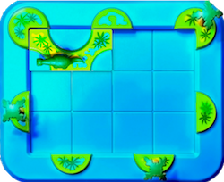 
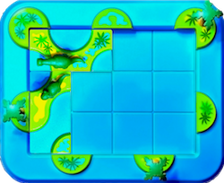
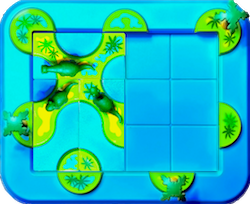
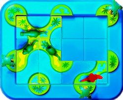
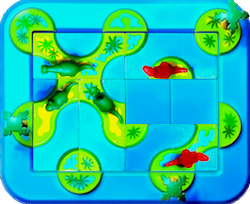
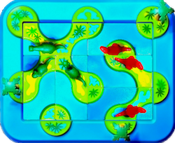

You can find visual representations of all of the objectives in the
`src/comp1110/ass1/gui/assets` [folder](src/comp1110/ass1/gui/assets),
each as a png image, named `<objective number>.png`.

## Objective Encoding

In our game, the objective of the game is encoded as two strings, one that
represents the direct connections between islands, and that represents tiles
that are placed at the start of the game (in the example above, the
location of tiles `b`, `d`, and `e` are prescribed by the objective) .
The `Objective` [class](src/comp1110/ass1/Objective.java) has all of
the objectives encoded for you already (they can be seen visually
[here](src/comp1110/ass1/gui/assets)).

### Locations

In our game we encode locations as (x, y) coordinates that refer to
the points on the board where *corners of tiles* might be
located. There are twenty such locations, `(0,0)` through to `(4,3)`,
as shown here:

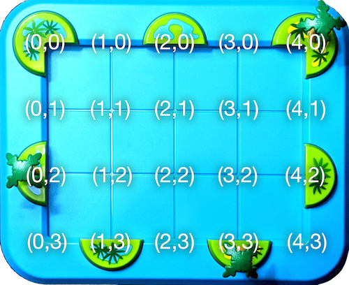

### Island Centers

All game objectives comprise of islands that are created by joining
some number of *island centers*, by appropriately placing tiles.
There are exactly ten island centers, seven centred on the board
perimeter, thus visible on the outside of the board, and another three
in the middle of the board (these island centers only become visible
once tiles are placed).  The ten island centers are at locations
`(0,0)`, `(2,0)`, `(4,0)`, `(1,1)`, `(3,1)`, `(0,2)`, `(2,2)`, `(4,2)`,
`(1,3)`, and `(3,3)`, as shown in the figure below:

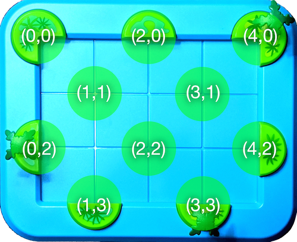

### Encoding of Island Connections

The game objectives are designed such that each objective contains
exactly six direct connections between the ten island centers.

If we consider the sample objective: 

the following pairs of island centers are directly connected:

- `(0,0)` and `(1,1)`,
- `(2,0)` and `(1,1)`,
- `(1,1)` and `(0,2)`,
- `(1,1)` and `(2,2)`,
- `(3,1)` and `(4,2)`,
- `(4,2)` and `(3,3)`

An island connection is encoded as a pair of character tuples, each
tuple representing one of the island centers.

For example, in the connection between `(0,0)` and `(1,1)`, `(0,0)` is
encoded as `"00"`, and `(1,1)` is encoded as `"11"`, and the
connection can be encoded as either `"0011"` or `"1100"`.

All direct connections in the sample objective can be encoded as
`"001120111102112231424233"`, which is a concatenation of six direct island
connections.

Notice that *indirect* connections are not encoded.
For example, in the above objective, there is an indirection connection
between `(0,0)` and `(2,0)` through island center `(1,1)`, but this
indirect connection is not encoded since only *direct* connections
are included in the encoding.

### Encoding of Tile Locations

The location of a tile is encoded as a four-character string, as follows:

0. The tile ID: `a` to `f`
1. The x-coordinate of the top-left corner: `0` to `3`
2. The y-coordinate of the top-left corner: `0` to `2`
3. The orientation of the tile: `N`,`E`,`S` or `W` 

### Encoding of Starting State

A challenge may start with some pre-placed tiles. For example, in the
above sample objective, the location of the tiles with green dinosaurs
is given to the player as part of the objective.

The starting state is encoded as the concatenation of four-character
tile location strings.  Thus the three green dinosaur tiles prescribed
in objective 1, above can be encoded as `"b00We01Sd11N"`,
corresponding to concatenation of three tile placements: `"b00W"`,
`"e01S"`, and `"d11N"`.

### Your task

Unfortunately your version of the assignment has some missing code.
While the graphical user interface is complete, some of the important
logic is missing, so it won't work as described above.  It is your job
to fix the problems, each identified by a `FIXME` comment in the
source code, so that the code works.  Do not change the code except by
following each of the assigned tasks.  When those tasks are completed,
the game will function correctly.  Check your changes by using the
provided unit tests.

## Legal and Ethical Issues

First, as with any work you do, you must abide by the principles of
[honesty and integrity](https://cs.anu.edu.au/courses/comp1110/09-integrity/). I
expect you to demonstrate honesty and integrity in everything you do.

In addition to those ground rules, you are to follow the rules one
would normally be subject to in a commercial setting. In particular,
you may make use of the works of others under two fundamental
conditions: a) your use of their work must be clearly acknowledged,
and b) your use of their work must be legal (for example, consistent
with any copyright and licensing that applies to the given material).
**Please understand that violation of these rules is a very serious
offence.** However, as long as you abide by these rules, you are
explicitly invited to conduct research and make use of a variety of
sources. You are also given an explicit means with which to declare
your use of other sources (via originality statements you must
complete). It is important to realize that you will be assessed on the
basis of your original contributions to the project. While you won't
be penalized for correctly attributed use of others' ideas, the work
of others will not be considered as part of your
contribution. Therefore, these rules allow you to copy another
student's work entirely if: a) they gave you permission to do so, and
b) you acknowledged that you had done so. Notice, however, that if you
were to do this you would have no original contribution and so would
receive no marks for the assignment (but you would not have broken any
rules either).

## Evaluation Criteria

**The mark breakdown is described on the
[deliverables](https://cs.anu.edu.au/courses/comp1110/assessments/deliverables/#D1A) page.**

**Pass**
* Tasks #1, #2, #3, #4, #5, and #6

**Credit**
* Tasks #7, #8, and #9 *(in addition to all tasks required for Pass)*

**Distinction**
* Tasks #10 and #11 *(in addition to all tasks required for Credit)*

**High Distinction**
* Tasks #12 and #13 *(in addition to all tasks required for Distinction)*

**IMPORTANT NOTE:** *It is very important that you understand that you are* **not**
*required to complete all elements of the
assignment. In fact, you are not encouraged to pursue the Distinction and High
Distinction tasks unless you feel motivated and able to do so. Recall that the
assignment is redeemable against the exam. The last parts of the assignment are
significantly harder than the others, but together worth only one additional mark. I
don't encourage you to spend too much time on this unless you are enjoying the
challenge of solving these harder problems.  Solutions to tasks #12 and #13
involve ideas that I have* **not covered**, *or not covered deeply in class; you may
need to go beyond the course material.*
